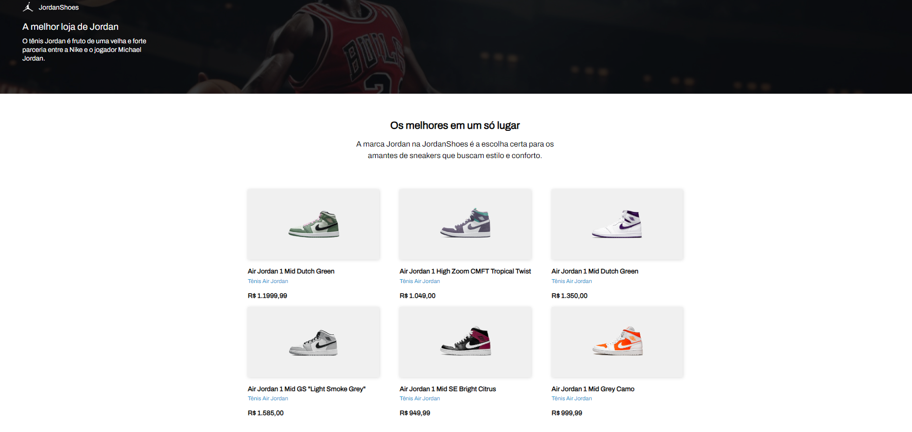

<p align="center">
  
</p>

<div align="center">
	<h1 align="center">Jordan Shoes</h1>
	<p align="center">Projeto criado em React.js e CSS, página responsiva para os tênis do jogador de basquete Michael Jordan.</p>
</div>

<h3  align="center">
		✅ Status: Completo ✅
</h3>
<div align="center">
<a href="https://jordanshoesr.vercel.app/">Acesse a aplicação clicando aqui!</a>
</div>

## 🗒️ Conteúdo

- [Sobre](#-Sobre)
- [Tecnologias](#-Tecnologias)
- [Pre-requisitos](#-Pre-requisitos)
- [Como rodar?](#-Rodando-a-aplicação)
- [Autor](#-Autor)

## 📖 Sobre
Projeto desenvolvido por meio do desafio Codelândia. Um projeto composto por uma página que exibe modelos de tênis Air Jordan, uma página responsiva para todas as telas. A ideia por trás da criação do projeto foi para experiência e estudos.

## 🛠 Tecnologias

As seguintes ferramentas foram utilizadas na construção do projeto:


## ⚠️ Pre-requisitos

Antes de começar, você precisará ter as seguintes ferramentas instaladas em sua máquina:
 <br />
- [VSCode](https://code.visualstudio.com/)
- [Git](https://git-scm.com)
- [NPM](https://www.npmjs.com)


## 🔥 Rodando a aplicação
```bash
# Clone este repositório.
# Acesse a pasta do projeto no VSCode.
# Execute no terminal "npm run dev".
# A aplicação iniciará localmente em sua máquina!
# Alternativamente, acesse-a através do link acima no repositório.
```

## 🤓 Autor

<div align="center" >
<a href="https://www.linkedin.com/in/leonisantosfernandes/">
 
 <br />
 <b>Leôni Santos</b></a> <a href="https://www.linkedin.com/in/leonisantosfernandes/" title="Linkedin">🚀
</a>
 <br />
 <br />
Feito com ❤️ por Leôni Santos 👋🏽 Entre em contato!

</div>

## 📕 Licença

Este projeto está sob a [MIT](./LICENSE).
