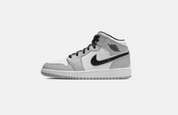

<p align="center"></p>

<div align="center">
	<h3 align="center">Jordan Shoes</h3>
	<p align="center">Project created in React.js and CSS, responsive page for basketball athlete Michael Jordan's sneakers.</p>
</div>
<h3  align="center">
		✅ Status: Completed ✅
</h3>
<div align="center">
<a href="https://jordanshoesr.vercel.app/">Access the application by clicking here!</a>
</div>

## 🗒️ Content

- [About](#-About)
- [Demonstration](#-Demonstration)
- [Technologies](#-Technologies)
- [Pre-requisites](#-Pre-requisites)
- [How to run?](#-Running-the-application)
- [Author](#-Author)

## 📖 About
Project developed through the Codelândia challenge. A project consisting of a page showcasing models of Air Jordan sneakers, a responsive page for all screens. The idea behind creating the project was for experience and studies.

## 📺 Demonstration

<p align="center">
  
</p>

## 🛠 Technologies

The following tools were used in the construction of the project:

- [React](https://developer.mozilla.org/en-US/docs/Learn/Tools_and_testing/Client-side_JavaScript_frameworks/React_getting_started)
- [CSS](https://developer.mozilla.org/pt-BR/docs/Web/CSS)

## ⚠️ Pre-requisites

Before you begin, you will need to have the following tools installed on your machine:

- [VSCode](https://code.visualstudio.com/)
- [Git](https://git-scm.com)
- [NPM](https://www.npmjs.com)


## 🔥 Running the application

```bash
# Download this repository.
# Access the project folder in VSCode.
# Run in the terminal "npm run dev".
# The application will start locally on your machine!
# Alternatively, access it through the link above in the repository.
```

<!-- AUTHOR -->

## 🤓 Author

<div align="center" >
<a href="https://www.linkedin.com/in/leonisantos/">
 
 <br />
 <b>Leôni Santos</b></a> <a href="https://www.linkedin.com/in/leonisantos/" title="Linkedin">🚀
</a>
 <br />
 <br />
Made with ❤️ by Leôni Santos 👋🏽 Get in touch!

</div>

## 📕License

This project is under the [MIT](./LICENSE).
